# AI Applications in Architecture — Master Guide

Comprehensive reference for all AI applications, algorithms, and research sources from **Assignments & Notes.docx**.

---

## Quick Reference Tables

### Set A — Core Six Applications

| # | Application | Algorithm | Paper | Year |
|---|-------------|-----------|-------|------|
| A1 | Architecture Style Classification | CNN + Transfer Learning (VGG16) | Khan et al. | 2020 |
| A2 | Floor Plan Generation | GAN + LSTM / Graph-GAN | Nauata et al. | 2020 |
| A3 | BIM Object Detection (3D Point Clouds) | Faster R-CNN + ResNet50 | Liu, Y. et al. | 2020 |
| A4 | Interior Design Recommendation | Collaborative Filtering + Matrix Factorization | Lee et al. | 2019 |
| A5 | Architecture Layout Optimization | Evolutionary Algorithms + Genetic Programming | Singh et al. | 2018 |
| A6 | 3D Building Reconstruction (LiDAR) | DNN + Conditional Random Fields | Wang, Y. et al. | 2020 |

### Set B — Extended Eight Applications (by Domain)

| Domain | Application | Algorithm | Paper |
|--------|-------------|-----------|-------|
| **Architecture Design** | Generative Design | GANs | Kalantari et al. (2018) |
| **Architecture Design** | Building Layout Optimization | EA + Genetic Programming | Singh et al. (2018) |
| **Interior Design** | Furniture Layout Generation | DDPG (Deep RL) | Li et al. (2020) |
| **Interior Design** | Interior Style Classification | CNN + Transfer Learning | Khan et al. (2020) |
| **Urban Planning** | Urban Layout Generation | GCN + GAN | Liu, J. et al. (2020) |
| **Urban Planning** | Land Use Classification | SVM + Texture Analysis | Chen et al. (2019) |
| **BIM** | BIM Object Detection | Faster R-CNN + ResNet50 | Liu, Y. et al. (2020) |
| **BIM** | BIM Construction Scheduling | DQN (Reinforcement Learning) | Kim et al. (2020) |

---

## Algorithm Family Overview

```mermaid
flowchart TB
    subgraph vision [Computer Vision]
        CNN[CNN + Transfer Learning]
        RCNN[Faster R-CNN]
        DNN[DNN + CRF]
    end
    subgraph generative [Generative Models]
        GAN[GANs]
        GCN_GAN[GCN + GAN]
    end
    subgraph optimization [Optimization]
        EA[Evolutionary Algorithms]
        RL[Reinforcement Learning]
    end
    subgraph classical [Classical ML]
        SVM[SVM + Texture]
        CF[Collaborative Filtering]
    end

    A1[Style Classification] --> CNN
    A2[Floor Plans] --> GAN
    A3[BIM Detection] --> RCNN
    A4[Interior Rec] --> CF
    A5[Layout Opt] --> EA
    A6[3D Reconstruction] --> DNN
    B1[Generative Design] --> GAN
    B3[Furniture Layout] --> RL
    B5[Urban Layout] --> GCN_GAN
    B6[Land Use] --> SVM
    B8[Construction Schedule] --> RL
```

---

## Detailed Application Notes

Each application has a dedicated file in [`applications/`](applications/):

| File | Application |
|------|-------------|
| [A1_architecture_style_classification.md](applications/A1_architecture_style_classification.md) | Architecture Style Classification |
| [A2_floor_plan_generation.md](applications/A2_floor_plan_generation.md) | Floor Plan Generation |
| [A3_bim_object_detection.md](applications/A3_bim_object_detection.md) | BIM Object Detection |
| [A4_interior_design_recommendation.md](applications/A4_interior_design_recommendation.md) | Interior Design Recommendation |
| [A5_layout_optimization.md](applications/A5_layout_optimization.md) | Architecture Layout Optimization |
| [A6_3d_building_reconstruction.md](applications/A6_3d_building_reconstruction.md) | 3D Building Reconstruction |
| [B1_generative_design_gan.md](applications/B1_generative_design_gan.md) | Generative Design (GANs) |
| [B3_furniture_layout_generation.md](applications/B3_furniture_layout_generation.md) | Furniture Layout Generation |
| [B4_interior_style_classification.md](applications/B4_interior_style_classification.md) | Interior Style Classification |
| [B5_urban_layout_generation.md](applications/B5_urban_layout_generation.md) | Urban Layout Generation |
| [B6_land_use_classification.md](applications/B6_land_use_classification.md) | Land Use Classification |
| [B8_bim_construction_scheduling.md](applications/B8_bim_construction_scheduling.md) | BIM Construction Scheduling |

---

## Full Bibliography

| Ref | Citation | DOI / Link |
|-----|----------|------------|
| [1] | Khan, S., et al. "Architecture Style Classification Using Deep Learning." *J. Building Engineering*, 33, 2020 | [10.1016/j.jobe.2020.101933](https://doi.org/10.1016/j.jobe.2020.101933) |
| [2] | Nauata, A., et al. "House-GAN: Relational GANs for Graph-constrained House Layout Generation." *ECCV*, 2020 | [arxiv:2003.06988](https://arxiv.org/abs/2003.06988) |
| [3] | Liu, Y., et al. "Detecting BIM Objects in 3D Point Clouds using Deep Learning." *Automation in Construction*, 118, 2020 | [10.1016/j.autcon.2020.103276](https://doi.org/10.1016/j.autcon.2020.103276) |
| [4] | Lee, J., et al. "Interior Design Recommendation System using Collaborative Filtering." *IJIM*, 18(2), 2019 | Publisher access |
| [5] | Singh, A. K., et al. "Evolutionary Optimization of Architecture Layouts." *J. Architectural Engineering*, 24(2), 2018 | [10.1061/(ASCE)AE.1943-5568.0000281](https://doi.org/10.1061/(ASCE)AE.1943-5568.0000281) |
| [6] | Wang, Y., et al. "3D Building Reconstruction from Aerial LiDAR Point Clouds." *ISPRS JPRS*, 157, 2020 | [10.1016/j.isprsjprs.2020.02.005](https://doi.org/10.1016/j.isprsjprs.2020.02.005) |
| [7] | Kalantari, N., et al. "Generative Design in Architecture using GANs." *ICML*, 2018 | Workshop/related: [arxiv:1806.07179](https://arxiv.org/abs/1806.07179) |
| [8] | Li, Y., et al. "Furniture Layout Generation using Deep Reinforcement Learning." *ICML*, 2020 | Related: [arxiv:2101.07462](https://arxiv.org/abs/2101.07462) |
| [9] | Liu, J., et al. "Urban Layout Generation using Graph Convolutional Networks." *ICML*, 2020 | Related: [arxiv:2008.09912](https://arxiv.org/abs/2008.09912) |
| [10] | Chen, X., et al. "Land Use Classification using Texture Analysis and SVM." *ISPRS JPRS*, 147, 2019 | [10.1016/j.isprsjprs.2019.02.023](https://doi.org/10.1016/j.isprsjprs.2019.02.023) |
| [11] | Kim, H., et al. "BIM-based Construction Scheduling using Reinforcement Learning." *JCEM*, 146(2), 2020 | [10.1061/(ASCE)CO.1943-7862.0001750](https://doi.org/10.1061/(ASCE)CO.1943-7862.0001750) |

---

## Downloaded Papers

See [`../papers&journals/README.md`](../papers&journals/README.md) for open-access PDFs saved locally and paywalled paper access notes.

## Related Course Materials

- [`06_research_references_elaborated.md`](06_research_references_elaborated.md) — Extended paper summaries
- [`05_architectural_quality_and_ai_applications.md`](05_architectural_quality_and_ai_applications.md) — Original assignment tables
